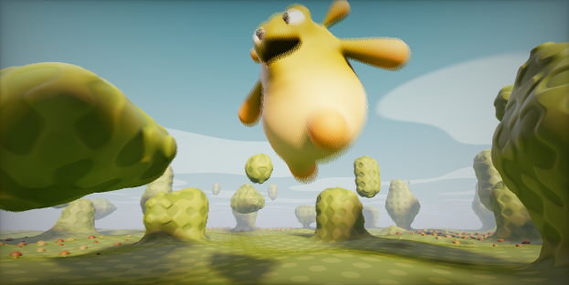
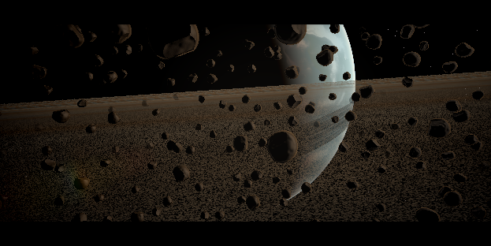
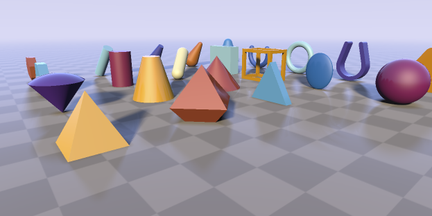

# shadertoy Native Player
### 说明
一个html程序,可本地播放 [shadertoy](https://www.shadertoy.com/) 网站平台的作品。

### 使用
* 将shadertoy的作品制作成播放资源
> 1. 打开一个shadertoy网站的作品 ,例如 [ProteanClouds](https://www.shadertoy.com/view/3l23Rh);
> 2. 新建目录文件夹 ./res/sToy/xxx/。 
> 3. 通道代码文件获取 ，比如 Image 通道, 新建文件 ./res/sToy/xxx/Image.glsl ,将同名标签中代码拷贝至该文件。 
> 3. 新建配置 ./res/sToy/xxx/stoyconfig.json 并设置。
``` 
//stoyconfig.json 配置例子
{
    //文件列表
    "files": {
        "Image": "./Image.glsl" //Image 通道代码文件
    }
}
``` 

* 播放指定资源
> 1. 启动一个 web服务,让 index.html 可以运行。
> 2. URL + ? + 资源名,的形式来指定资源。
``` 
//例如 sample
http://localhost:5500/?ProteanClouds
[https://anseyuyin.github.io/shadertoyNativePlayer/?ProteanClouds](https://anseyuyin.github.io/shadertoyNativePlayer/?ProteanClouds)
```


### 测试作品
点击图片可跳转到样例

[](https://anseyuyin.github.io/shadertoyNativePlayer/?seascape)
[](https://anseyuyin.github.io/shadertoyNativePlayer/?happyJumping)
[](https://anseyuyin.github.io/shadertoyNativePlayer/?PlanetShadertoy)
[](https://anseyuyin.github.io/shadertoyNativePlayer/?ProteanClouds)
[](https://anseyuyin.github.io/shadertoyNativePlayer/?raymarchingPrimitives)

### 特性
* 资源配置化shadertoy作品
* 本地加载播放shadertoy作品

### 支持详细情况
|官方 uniform 支持   |进度   |备注   |
|-      |-      |-      |
|iResolution| 完成 | uniform vec3   //视口分辨率 (in pixels)|
|iTime      | 完成 | uniform float  //播放时间 (in seconds)|
|iTimeDelta | 完成 | uniform float  //帧间隔变化时间 (in seconds)|
|iFrame     | 完成 | uniform int    //播放的帧数|
|iMouse     | 完成 | uniform vec4  //鼠标像素坐标. xy: 当前 (按下状态), zw: click|
|iChannelTime[4]| 待处理 | uniform float  //通道的播放时间 (in seconds)|
|iChannelResolution[4]| 待处理 | uniform vec3  //通道的分辨率 (in pixels)|
|iChannel0..3   | 待处理 | uniform samplerXX  //输入通道. XX = 2D/Cube|
|iDate   | 待处理 | uniform vec4  //日期数据 (year, month, day, time in seconds)|
|iSampleRate   | 待处理 | uniform float   //声音采样率 sound sample rate (i.e., 44100)|

|官方 iChannel 输入支持   |进度   |备注   |
|-      |-      |-      |
|keyboard   | 待处理 | 键盘按键输入|
|...   | 待处理 | |
|...   | 待处理 | |

|官方 pass 功能支持   |进度   |备注   |
|-      |-      |-      |
|Image    | 部分完成 | 基础图像渲染通道|
|Common   | 待处理 | 公共代码容器 |
|BufferA    | 待处理 | 2d纹理缓存A|
|BufferB    | 待处理 | 2d纹理缓存B|
|BufferC    | 待处理 | 2d纹理缓存C|
|BufferD    | 待处理 | 2d纹理缓存D|
|Cube A     | 待处理 | cube纹理缓存A|
|Sound      | 待处理 | 音效演奏,不参与渲染|

